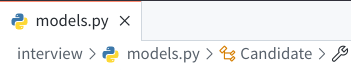

# 职位管理系统 - 建模

- 职位名称
- 类别
- 工作地点
- 职位职责
- 职位要求
- 发布人
- 发布日期
- 修改日期

# 创建应用

```sh
python manage.py startapp jobs
```

# 创建Model

## 创建 model 模型

- `blank`参数：设置字段允许为空
- `choices`参数：指定 Django 固定类型 
- `verbose_name`参数：指定字段备注
- `model.ForeignKey`：外键关联
- `default`参数：指定初始值
- `null`参数：允许初始值为`null`

```python
# jobs/models.py

from django.db import models
from django.contrib.auth.models import User
# Create your models here.

JobTypes = [(0, "技术类"), (1, "产品类"), (2, "运营类"), (3, "设计类")]

Cites = [(0, "北京"), (1, "上海"), (2, "深圳")]


class Job(models.Model):
    # blank 指定该字段不可为空
    # choices 指定为一些固定类型
    job_type = models.SmallIntegerField(blank=False, choices=JobTypes, verbose_name="职位类别")
    job_name = models.CharField(max_length=250, blank=False, verbose_name="职位名称")
    job_city = models.SmallIntegerField(choices=Cites, blank=False, verbose_name="工作地点")
    job_reponsibility = models.TextField(max_length=1024, verbose_name="职位职责")
    job_requirement = models.TextField(max_length=1024, blank=False, verbose_name="职位要求")

    # 引用一个另外的模型 Django 内部的 User
    # - null 指定该字段的值可以为空
    # - on_delete 记录删除时对应的数据如何处理。因为 on_delete 使用的是函数，所以末尾不需要加括号
    creator = models.ForeignKey(User, max_length=200, verbose_name="创建人", null=True, on_delete=models.SET_NULL)
    
    created_date = models.DateTimeField(verbose_name="创建日期", default=datetime.now)
    modified_date = models.DateTimeField(verbose_name="修改时间", default=datetime.now)
```

## 将 models 注册到 admin


此时访问管理员页面就可以看到页面中新增了个 `Jobs` 条目：


## 数据同步 在数据库中建立 Job 模型

```sh
# 创建脚本
python manage.py makemigrations
# 变动生效
python manage.py migrate 
```

然后就可以访问刚刚新增了条目的页面： http://localhost:2022/admin/jobs/job/

## 在管理页面显示数据

- 隐藏一些无须手动存储的字段
- 将隐藏的字段自动设定存储值


---


# Django的自定义模板

- 模板继承与块

  - 模板继承与寻定义一个骨架模板，骨架包含站点上的公共元素，比如头部导航，尾部导航

  - 骨架模板里面可以定义`Block`块，每个`Block`块都可以在继承的页面上定义或覆盖

  - 一个页面可以继承自另一个页面


## URL映射


## 视图处理函数

- 使用 `HttpResponse` 手动返回内容
- 使用 `loader` 函数渲染模板
- `objects.order_by` 将对象的列表值排序后返回
- `loader.get_template` 导入模板文件


# 产品背景、迭代思维、MVP产品规划


# 企业级数据库设计原则

## 基础原则（必须遵守）

1. 结构清晰：表名、字段命名可以一眼看懂
2. 唯一职责：一张表一个用途，不装不相关的东西
3. 主键原则：设计不带物理意义的主键；有唯一约束，确保幂。因为物理意义的东西是有可能改变的，比如名字、性别、地址等

## 扩展性原则（影响系统的性能和容量）

1. 长短分离：可以扩展，长文本独立存储；有合适的容量设计，预防容量不足的情况
2. 冷热分离：当前的数据和历史数据分离开来。把最近使用的数据分离出来，将以前的数据放到历史数据存储中去。
3. 索引完备：有合适索引方便查询
4. 不使用关联查询：不使用一切的SQL Join操作，不做2个表或以上的表的关联查询

## 完备性原则（必须遵守）

1. 完整性：保证数据的准确性和完整性，重要的内容都有记录
2. 可追溯：可追溯创建时间，修改时间，可以逻辑删除（譬如做个标记表示那条东西没用）
3. 一致性原则：数据之间保持一致，尽可能避免同样的数据存储在不同表里

# 面试表创建



```python
from django.db import models

# Create your models here.

# 第一轮面试结果
FIRST_INTERVIEW_RESULT_TYPE = ((u'建议复试', u'建议复试'),
                               (u'待定', u'待定'),
                               (u'放弃', u'放弃'))

# 复试面试建议
INTERVIEW_RESULT_TYPE = ((u'建议复试', u'建议复试'),
                         (u'待定', u'待定'),
                         (u'放弃', u'放弃'))

# 候选人学历
DEGREE_TYPE = ((u'本科', u'本科'), (u'硕士', u'硕士'), (u'博士', u'博士'))

# HR终面结论
HR_SCORE_TYPE = (('S', 'S'), ('A', 'A'), ('B', 'B'), ('C', 'C'))


class Candidate(models.Model):
    # 基础信息
    userid = models.IntegerField(verbose_name=u'应聘者ID', unique=True, blank=True, null=True)
    username = models.CharField(verbose_name=u"姓名", max_length=135)
    city = models.CharField(verbose_name=u"城市", max_length=135)
    phone = models.CharField(verbose_name=u'手机号码', max_length=135)
    email = models.EmailField(verbose_name=u'邮箱', max_length=135, blank=True)
    apply_position = models.CharField(verbose_name=u"应聘职位", max_length=135, blank=True)
    born_address = models.CharField(verbose_name=u'生源地', max_length=135, blank=True)
    gender = models.CharField(verbose_name=u'性别', max_length=135, blank=True)
    candidate_remark = models.CharField(verbose_name=u'候选人信息备注', max_length=135, blank=True)

    # 学校与学历信息
    bachelor_school = models.CharField(verbose_name=u'本科学校', max_length=135, blank=True)
    master_school = models.CharField(verbose_name=u'研究生学校', max_length=135, blank=True)
    doctor_school = models.CharField(verbose_name=u'博士生学校', max_length=135, blank=True)
    major = models.CharField(verbose_name=u'专业', max_length=135, blank=True)
    degree = models.CharField(verbose_name=u'学历', max_length=135, choices=DEGREE_TYPE, blank=True)

    # 综合能力测评成绩 笔试测评成绩
    test_score_of_general_ability = models.DecimalField(decimal_places=1, null=True, max_digits=3, blank=True,
                                                        verbose_name=u'综合能力测评成绩')
    paper_score = models.DecimalField(decimal_places=1, null=True, max_digits=3, blank=True, verbose_name=u'笔试成绩')

    # 第一轮面试记录
    first_score = models.DecimalField(decimal_places=1, null=True, max_digits=2, blank=True, verbose_name=u'初试分')
    first_learning_ability = models.DecimalField(decimal_places=1, null=True, max_digits=2, blank=True, verbose_name=u'学习能力得分')
    first_professional_competency = models.DecimalField(decimal_places=1, null=True, max_digits=2, blank=True, verbose_name=u'专业能力得分')
    first_advantage = models.TextField(blank=True, verbose_name=u'优势', max_length=1024)
    first_disadvantage = models.TextField(max_length=3, blank=True, verbose_name=u'顾虑和不足')
    first_result = models.CharField(max_length=256, choices=FIRST_INTERVIEW_RESULT_TYPE, blank=True, verbose_name=u'初试结果')
    first_recommend_position = models.CharField(max_length=256, blank=True, verbose_name=u'推荐部门')
    first_interviewer = models.CharField(verbose_name=u'面试官', max_length=135, blank=True)
    first_remark = models.CharField(verbose_name=u'初试备注', max_length=135, blank=True)

    # 第二轮面试记录
    second_score = models.DecimalField(verbose_name=u'专业复试得分', decimal_places=1, null=True, max_digits=2, blank=True)
    second_learning_ability = models.DecimalField(verbose_name=u'学习能力得分', decimal_places=1, max_digits=2, blank=True, null=True)
    second_professsional_competency = models.DecimalField(verbose_name=u'专业能力得分', decimal_places=1, null=True, max_digits=2, blank=True)
    second_pursue_of_excellence = models.DecimalField(verbose_name=u'追求卓越得分', decimal_places=1, null=True, max_digits=2, blank=True)
    second_communication_ability = models.DecimalField(verbose_name=u'沟通能力得分', decimal_places=1, null=True, max_digits=2, blank=True)
    second_pressure_score = models.DecimalField(verbose_name=u'抗压能力得分', decimal_places=1, null=True, max_digits=2, blank=True)
    second_advantage = models.CharField(verbose_name=u'优势', max_length=1024, blank=True)
    second_disadvantage = models.TextField(verbose_name=u'顾虑和不足')
    second_result = models.CharField(max_length=256, choices=FIRST_INTERVIEW_RESULT_TYPE, blank=True, verbose_name=u'专业复试结果')
    second_recommend_position = models.CharField(max_length=256, blank=True, verbose_name=u'建议方向或推荐部门')
    second_interviewer = models.CharField(verbose_name=u'面试官', max_length=256, blank=True)
    second_remark = models.CharField(verbose_name=u'专业复试备注', max_length=135, blank=True)

    # HR终面
    hr_score = models.CharField(verbose_name=u'HR复试综合等级', max_length=10, choices=HR_SCORE_TYPE, blank=True)
    hr_responseibility = models.CharField(verbose_name=u'HR责任心', max_length=10, choices=HR_SCORE_TYPE, blank=True)
    hr_communication_ability = models.CharField(verbose_name=u'HR坦诚沟通', max_length=10, choices=HR_SCORE_TYPE, blank=True)
    hr_logic_ability = models.CharField(verbose_name=u'HR逻辑思维', max_length=10, choices=HR_SCORE_TYPE, blank=True)
    hr_potential = models.CharField(verbose_name=u'HR发展潜力', max_length=10, choices=HR_SCORE_TYPE, blank=True)
    hr_stability = models.CharField(verbose_name=u'HR稳定性', max_length=10, choices=HR_SCORE_TYPE, blank=True)
    hr_advantage = models.TextField(verbose_name=u'优势', max_length=1024, blank=True)
    hr_disadvantage = models.TextField(verbose_name=u'顾虑和不足', max_length=1024, blank=True)
    hr_result = models.CharField(max_length=256, choices=FIRST_INTERVIEW_RESULT_TYPE, blank=True, verbose_name=u'HR复试结果')
    hr_interviewer = models.CharField(verbose_name=u'HR面试官', max_length=256, blank=True)
    hr_remark = models.CharField(verbose_name=u'HR复试备注', max_length=256, blank=True)

    creator = models.CharField(verbose_name=u'候选人数据的创建人', max_length=256, blank=True)
    creator_date = models.DateTimeField(verbose_name=u'创建时间', auto_now_add=True)
    modified_date = models.DateTimeField(verbose_name=u'更新时间', auto_now_add=True, null=True, blank=True)
    last_editor = models.CharField(verbose_name=u'最后编辑者', max_length=256, blank=True)


    class Meta:
        db_table = u'candidate'
        verbose_name = u'应聘者'
        verbose_name_plural = u'应聘者'
    
    def __str__(self):
        return self.username
    
```

## 在 admin 注册页面并配置展示的字段

```python
from django.contrib import admin

# Register your models here.

from .models import Candidate

class CandidateAdmin(admin.ModelAdmin):
    exclude = ('creator', 'created_date', 'modified_date')
    list_display = ("username", "city", "bachelor_school", "first_score", "first_result", "first_interviewer",
                    "second_result", "second_interviewer", "hr_score", "hr_result", "last_editor")

admin.site.register(Candidate, CandidateAdmin)
```


可以看到此处分类过多，为了让各个人知道自己该填哪些内容，对内容进行分区。

## 字段分区

```python
from django.contrib import admin

# Register your models here.

from .models import Candidate

class CandidateAdmin(admin.ModelAdmin):
    exclude = ('creator', 'created_date', 'modified_date')
    list_display = ("username", "city", "bachelor_school", "first_score", "first_result", "first_interviewer",
                    "second_result", "second_interviewer", "hr_score", "hr_result", "last_editor")
    

    fieldsets = (
        (None, {'fields': ("userid","username","city","phone","email","apply_position","born_address","gender","candidate_remark","bachelor_school","master_school","doctor_school","major","degree","test_score_of_general_ability","paper_score")}),            # 基本信息 可以不展示 所以这里不显示它的文本内容标题 有几个时间字段隐藏了所以这里不显示
        ('第一轮面试记录', {'fields': ("first_score","first_learning_ability","first_professional_competency","first_advantage","first_disadvantage","first_result","first_recommend_position","first_interviewer","first_remark")}),                   # 面试第一次
        ('第二轮专业复试记录', {'fields': ("second_score","second_learning_ability","second_professsional_competency","second_pursue_of_excellence","second_communication_ability","second_pressure_score","second_advantage","second_disadvantage","second_result","second_recommend_position","second_interviewer","second_remark")}),                   # 面试第二次
        ('HR复试记录', {'fields': ("hr_score","hr_responseibility","hr_communication_ability","hr_logic_ability","hr_potential","hr_stability","hr_advantage","hr_disadvantage","hr_result","hr_interviewer","hr_remark")}),                   # 面试第三次
    )


admin.site.register(Candidate, CandidateAdmin)
```


### 合并多个字段，让多个字段在一行内显示


